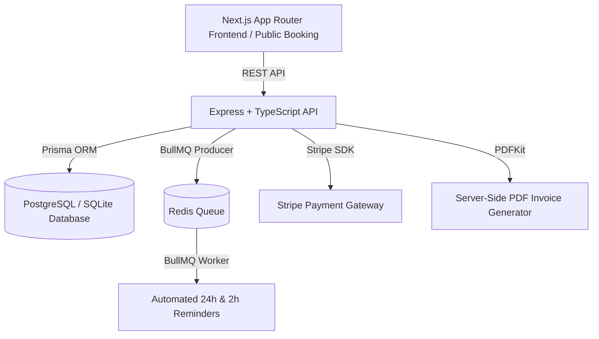

# BookEase - Production SaaS Booking, Billing & Reminder Platform

**BookEase** is a multi-tenant booking, billing, and appointment reminder platform built for small service businesses (salons, clinics, tutors, gyms, repair shops).



---

## 🚀 Key Features

1. **Multi-Tenant Architecture**: Single database with strict row-level tenant isolation (`tenant_id` on all tenant-owned entities).
2. **Branded Public Booking Page (`/b/[slug]`)**: 6-step online booking portal for clients (Service -> Staff -> Slot -> Details -> Deposit -> Confirmation).
3. **Smart Availability Engine**: Calculates open slots from staff working hours, service duration + buffers, active time-offs, and existing bookings.
4. **Double-Booking Protection**: Strict database transaction locks prevent race conditions under concurrent booking requests.
5. **Deposit Payments & Webhooks**: Stripe payment gateway integration with idempotency handling.
6. **Automated Reminders**: BullMQ & Redis worker for 24h/2h prior appointment notifications via Email (Resend / Nodemailer) & SMS stubs.
7. **Server-Side PDF Invoices**: Instant PDF invoice generation (`pdfkit`) emailed and downloadable per paid booking.
8. **Owner Analytics Dashboard**: Comprehensive metrics (total revenue, no-show rate, repeat customer rate, top services).

---

## 🛠️ Monorepo Structure

```
bookease/
├── apps/
│   ├── api/          # Express + TypeScript + Prisma ORM + BullMQ + PDFKit
│   └── web/          # Next.js 14 App Router + Tailwind CSS + Lucide Icons
├── docker-compose.yml
├── .env.example
└── README.md
```

---

## ⚡ Quick Start (Local Development)

### 1. Prerequisites
- Node.js >= v20
- npm >= v10

### 2. Setup Environment
```bash
cp .env.example .env
```

### 3. Install Dependencies
```bash
npm install
```

### 4. Database Push & Seed
```bash
npm run db:push
npm run db:seed
```

### 5. Start Development Servers
```bash
npm run dev
```
- **Frontend App**: `http://localhost:3000`
- **Backend API**: `http://localhost:4000/api`
- **Health Check**: `http://localhost:4000/health`
- **Live Demo Booking Page**: `http://localhost:3000/b/glow-style`

### 6. Run Automated Integration Tests
```bash
npm run test
```

---

## 🔐 Demo Credentials

| Role | Email | Password | Business Slug |
|---|---|---|---|
| **Owner** | `owner@glowstyle.com` | `password123` | `glow-style` |
| **Staff** | `alex@glowstyle.com` | `password123` | `glow-style` |
